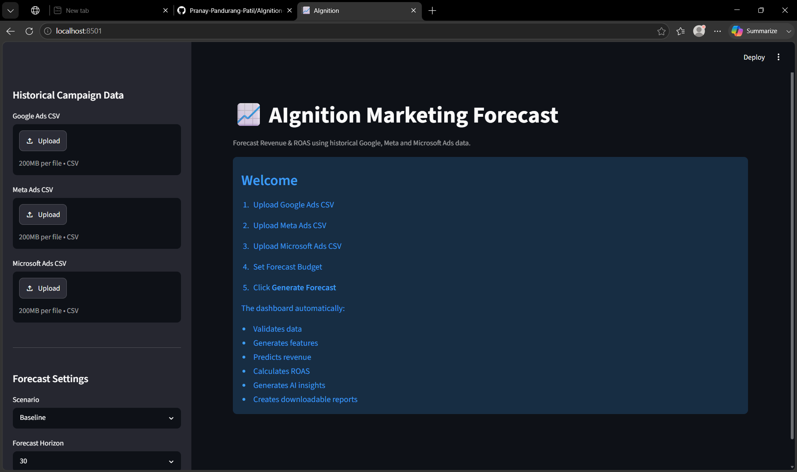
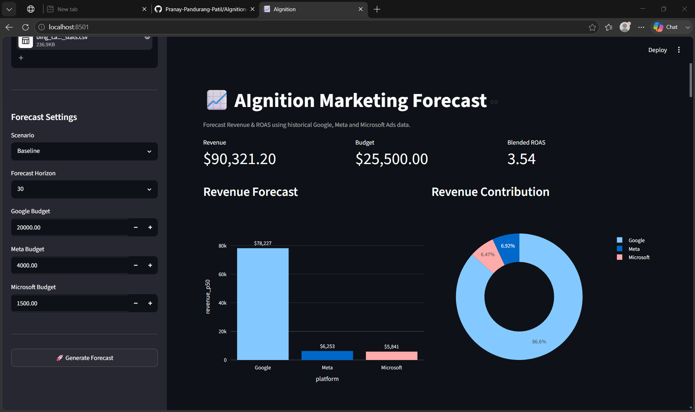
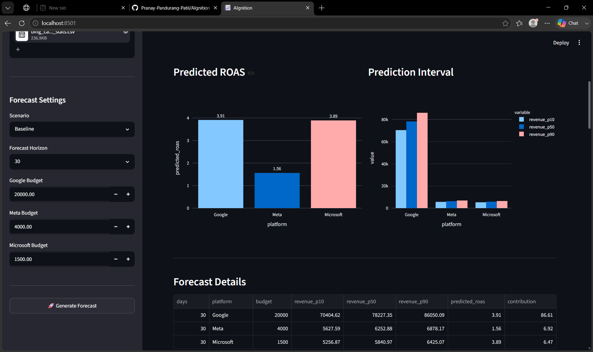
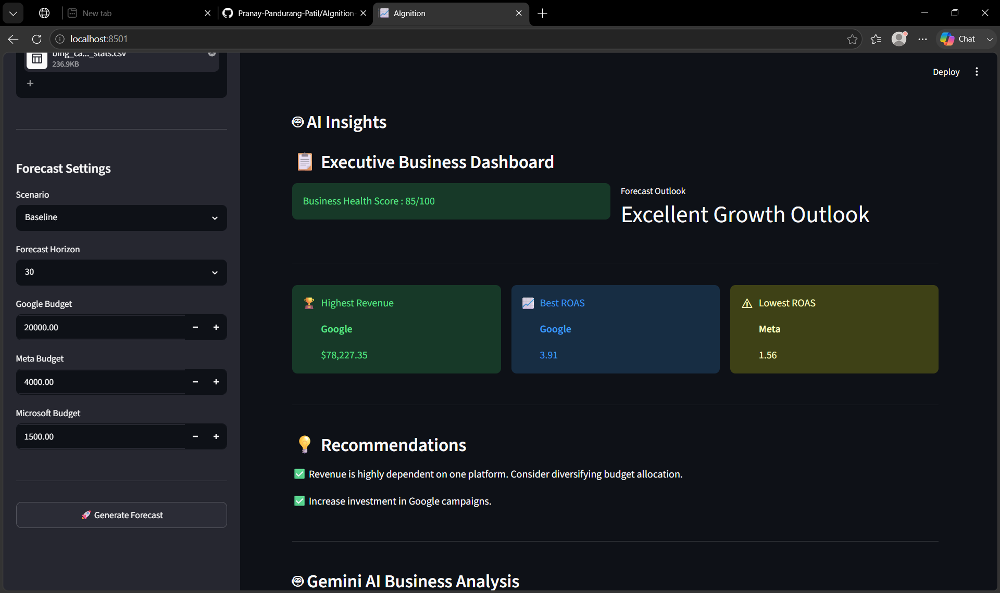
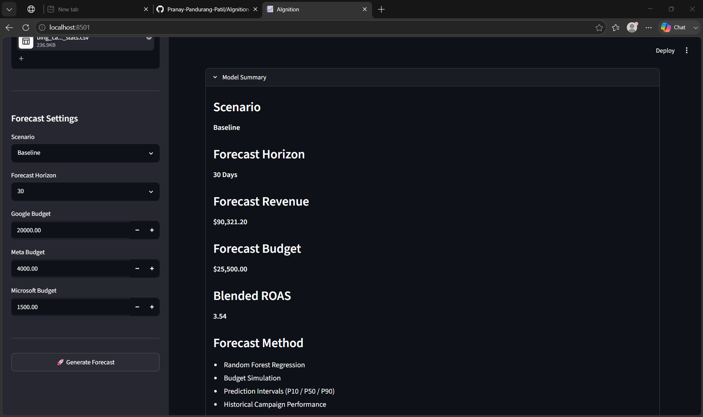

<div align="center">

# 🚀 AIgnition

### AI-Assisted Probabilistic Revenue Forecasting for E-commerce Marketing

**AI-Powered Marketing Revenue Forecasting & Budget Simulation Dashboard**

Forecast Revenue • Predict ROAS • Optimize Marketing Budgets • AI Business Insights


</div>

---

## 📖 Overview

AIgnition is an AI-assisted marketing forecasting utility developed for the **NetElixir AIgnition 3.0 Hackathon**.

The application enables digital marketing agencies and e-commerce businesses to forecast future marketing performance using historical advertising data from multiple paid media platforms.

Instead of generating a single prediction, AIgnition produces **probabilistic revenue forecasts (P10, P50, P90)**, predicts **channel-level ROAS**, performs **budget simulation**, and generates **AI-powered business recommendations** to support strategic marketing decisions.

The system integrates campaign data from:

- Google Ads
- Meta Ads
- Microsoft Ads (Bing)

to create a unified marketing forecasting dashboard.

---

## 📑 Table of Contents

- Overview
- Problem Statement
- Features
- Tech Stack
- Project Structure
- Application Preview
- Installation
- Environment Variables
- Running the Application
- Machine Learning Pipeline
- Future Improvements
- Author
- Acknowledgements
- License
---
# 🎯 Problem Statement

Marketing agencies manage advertising budgets across multiple platforms with different reporting structures, campaign types, and performance metrics.

Traditional forecasting methods rely heavily on spreadsheets, making them:

- Manual
- Time-consuming
- Difficult to scale
- Hard to explain
- Unable to estimate uncertainty

AIgnition solves these problems using Machine Learning and Generative AI to produce realistic, explainable, and business-oriented forecasts.

---

# ✨ Features

### 📂 Multi-Platform Data Integration

- Supports Google Ads, Meta Ads, and Microsoft Ads (Bing)
- Automatic campaign data standardization
- Unified cross-platform marketing dataset
- Data validation before forecasting

---

### 📊 AI-Powered Revenue Forecasting

- Probabilistic Revenue Prediction (P10, P50, P90)
- Channel-level Revenue Forecast
- Blended ROAS Prediction
- Revenue Contribution Analysis
- Forecast horizons of **30, 60, and 90 days**

---

### 💰 Budget Simulation

- Independent budget allocation for each platform
- Real-time forecast updates based on budget changes
- Marketing spend optimization support
- Scenario-based planning

---

### 🤖 AI Business Intelligence

Powered by **Google Gemini AI** to generate:

- Executive Summary
- Forecast Explanation
- Budget Allocation Analysis
- Operational Risk Assessment
- Growth Opportunities
- Budget Optimization Recommendations
- Strategic Business Takeaways

---

### 📈 Interactive Dashboard

- Executive KPI Cards
- Business Health Score
- Forecast Outlook
- Revenue Distribution
- ROAS Comparison
- Revenue Contribution Analysis
- Forecast Detail Table
- AI Insights
- Download Forecast Report
- Download Prediction CSV

---

### 📦 Export & Reporting

- Forecast Report (.txt)
- Prediction CSV Export
- AI-generated Business Summary
- Business-ready Forecast Documentation

---

# 🛠️ Tech Stack

| Category | Technologies |
|----------|--------------|
| **Programming Language** | Python 3.12 |
| **Frontend** | Streamlit |
| **Data Processing** | Pandas, NumPy |
| **Machine Learning** | Scikit-learn, XGBoost |
| **AI Assistant** | Google Gemini API |
| **Visualization** | Plotly |
| **Model Serialization** | Pickle |
| **Environment Management** | Python Virtual Environment (.venv) |
| **Version Control** | Git & GitHub |

---
# 📋 Requirements

- Python 3.12+
- pip
- Git
- Google Gemini API Key
# 📂 Project Structure
---
```text
AIgnition/
│
├── data/                      # Input datasets
├── output/                    # Generated forecast reports
├── pickle/                    # Trained ML models & encoders
├── src/                       # Source code
│   ├── ai_assistant.py
│   ├── budget_simulator.py
│   ├── data_loader.py
│   ├── forecast.py
│   ├── generate_features.py
│   ├── predict.py
│   ├── prediction_intervals.py
│   ├── train_model.py
│   ├── validate_data.py
│   └── ...
│
├── app.py                     # Streamlit Dashboard
├── requirements.txt           # Project dependencies
├── run.sh                     # Project execution script
└── README.md
```
# 🏗️ System Workflow
mermaid
...
flowchart LR

A[Upload CSV Files]
--> B[Data Validation]
--> C[Feature Engineering]
--> D[Random Forest Model]
--> E[Prediction Intervals]
--> F[Budget Simulation]
--> G[Gemini AI Analysis]
--> H[Interactive Dashboard]
---
# 📸 Application Preview

## 🏠 Home Screen



---

## 📊 Revenue Forecast Dashboard



---

## 📈 Forecast Analytics



---

## 🤖 AI Business Insights



---

## 📑 Model Summary



---
# ⚙️ Installation

## Clone the Repository

```bash
git clone https://github.com/Pranay-Pandurang-Patil/AIgnition-Marketing-Forecast.git
cd AIgnition-Marketing-Forecast
```

## Create a Virtual Environment

### Windows

```bash
python -m venv .venv
.venv\Scripts\activate
```

### Linux / macOS

```bash
python3 -m venv .venv
source .venv/bin/activate
```

## Install Dependencies

```bash
pip install -r requirements.txt
```

---
# 🔑 Environment Variables

Create a `.env` file in the project root.

```env
GOOGLE_API_KEY=YOUR_GEMINI_API_KEY
```

The application uses the Gemini API to generate AI-powered business insights.

---
# 🚀 Running the Application

Launch the Streamlit dashboard:

```bash
streamlit run app.py
```

Open your browser and navigate to:

```
http://localhost:8501
```

---
# 🧠 Machine Learning Pipeline

The application uses a Random Forest Regression model trained on historical campaign performance.

Predictions are enhanced using engineered features and probabilistic prediction intervals to estimate forecast uncertainty.

The forecasting workflow consists of the following stages:

1. Load historical marketing campaign data
2. Validate and standardize datasets
3. Generate engineered features
4. Predict revenue using Random Forest Regression
5. Calculate probabilistic prediction intervals (P10, P50, P90)
6. Estimate blended ROAS
7. Generate AI-powered business insights using Google Gemini
8. Display interactive dashboard and export reports

---
# 🔮 Future Improvements

- Real-time Google Ads API integration
- Meta Marketing API integration
- Microsoft Advertising API integration
- Time-series forecasting models (Prophet / LSTM)
- Automated model retraining
- Multi-user authentication
- Cloud deployment
- Interactive scenario comparison
- PDF report generation
- Marketing anomaly detection

---

# 👨‍💻 Author

**Pranay Pandurang Patil**

B.Tech Computer Engineering Student

**Areas of Interest**
- Artificial Intelligence
- Machine Learning
- Data Science
- Full-Stack Development

**GitHub**
- https://github.com/Pranay-Pandurang-Patil


---

# 🙏 Acknowledgements

This project was developed for the **NetElixir AIgnition 3.0 Hackathon**.

The project leverages several open-source technologies, including:

- Python
- Streamlit
- Scikit-learn
- XGBoost
- Plotly
- Google Gemini API
- Pandas
- NumPy

Special thanks to **NetElixir** for organizing the hackathon and providing an opportunity to build innovative AI-driven marketing solutions.

---

## 📄 License

This project was developed for educational purposes and as part of the NetElixir AIgnition 3.0 Hackathon.

Feel free to explore, learn from, and adapt the code with appropriate attribution.

---

---

<div align="center">

### ⭐ If you found this project useful, please consider giving it a star!

**AIgnition — AI-Assisted Probabilistic Revenue Forecasting for E-commerce Marketing**

</div>
